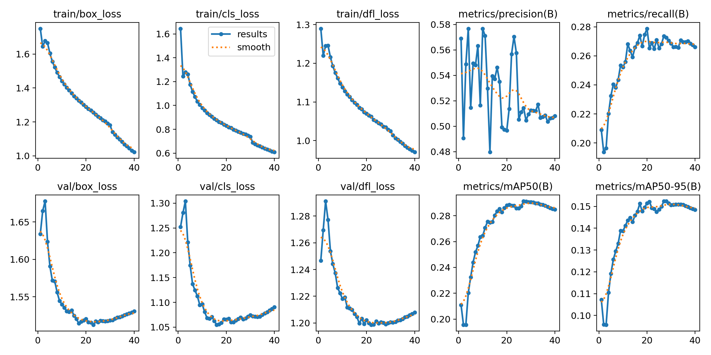
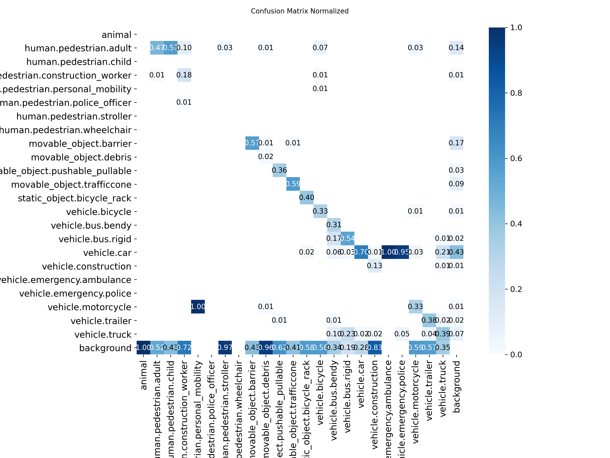
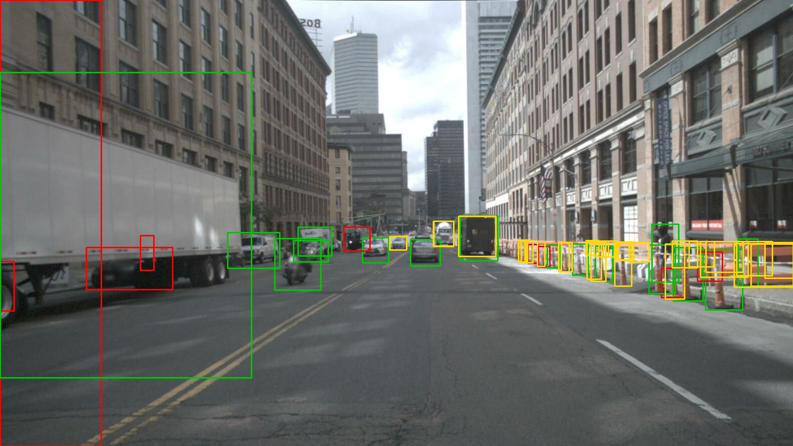

# Perception Evaluation Pipeline

An object-detection evaluation pipeline for autonomous-driving perception, built
on the [nuScenes](https://www.nuscenes.org/) dataset. It fine-tunes YOLOv8 on
nuScenes camera keyframes and measures the gain over a COCO-pretrained baseline
with a proper, leakage-free evaluation protocol.

The interesting part of this project is not the final mAP number. It is the
evaluation methodology and the three pipeline bugs that had to be found and
fixed before any number could be trusted — the kind of debugging that decides
whether a perception metric means anything.

## Headline result

Fine-tuning YOLOv8s on the full nuScenes trainval set (CAM_FRONT keyframes),
evaluated on the official validation split:

| Metric | Pretrained baseline (COCO) | Fine-tuned (nuScenes) | Change |
|---|---|---|---|
| mAP@0.5 | 0.079 | 0.291 | +0.212 (+268%) |
| mAP@0.5:0.95 | — | 0.152 | — |



Evaluated on 6,019 validation images / 53,003 annotated instances across 23
classes. Training: 40 epochs, ~6.1 hours on a single NVIDIA T4.

The overall mAP is averaged over all 23 classes, including several that are too
rare to learn (animal: 4 instances, ambulance: 11, child: 30). The common,
safety-relevant classes score much higher — see the per-class breakdown below.

## Per-class results (mAP@0.5)

| Class | Baseline | Fine-tuned | Change |
|---|---|---|---|
| vehicle.car | 0.522 | 0.733 | +0.211 |
| vehicle.bus.rigid | 0.512 | 0.672 | +0.160 |
| movable_object.barrier | 0.000 | 0.570 | +0.570 |
| movable_object.trafficcone | 0.000 | 0.565 | +0.565 |
| human.pedestrian.adult | 0.224 | 0.497 | +0.273 |
| vehicle.bus.bendy | 0.000 | 0.433 | +0.433 |
| static_object.bicycle_rack | 0.000 | 0.433 | +0.433 |
| vehicle.truck | 0.261 | 0.415 | +0.154 |
| vehicle.trailer | 0.000 | 0.412 | +0.412 |
| vehicle.motorcycle | 0.074 | 0.386 | +0.312 |
| vehicle.bicycle | 0.073 | 0.377 | +0.304 |
| movable_object.pushable_pullable | 0.000 | 0.334 | +0.334 |
| vehicle.construction | 0.000 | 0.087 | +0.087 |



The largest absolute gains are on nuScenes-specific classes a COCO-pretrained
model cannot predict at all — barrier, traffic cone, trailer, and the rigid/bendy
bus split all rise from exactly 0.0. That gap is the quantified argument for
domain fine-tuning: the baseline is structurally blind to these classes, and
fine-tuning is what makes them detectable. Shared classes (car, pedestrian, bus,
truck) also improve, showing the model adapting to nuScenes camera viewpoints and
object scales rather than just learning new labels.

## How the pipeline works

```
nuScenes trainval (CAM_FRONT keyframes)
        |
        v
 3D box -> camera-frame projection      (global -> ego -> camera transform)
        |
        v
 YOLO-format label conversion           (official train/val scene split)
        |
        v
 YOLOv8s fine-tuning                     (40 epochs, T4 GPU)
        |
        v
 Evaluation vs. pretrained baseline      (canonical class mapping, IoU-matched AP)
```

- `convert_full.py` — converts the full trainval set, assigning each sample to
  train or val by the **official nuScenes scene split** so no scene's frames
  straddle both sets.
- `src/dataset_converter.py` / `src/dataset_loader.py` — project 3D annotation
  boxes into the camera frame and emit 2D boxes.
- `src/evaluator.py` / `src/metrics.py` / `src/class_mapping.py` — IoU-matched
  per-class AP with VOC-style interpolation and a canonical cross-dataset class
  mapping.
- `run_baseline_full.py` — scores pretrained YOLOv8s on the same val split for
  the before/after comparison.

## Debugging the evaluation pipeline

An earlier version of this pipeline reported numbers that were not trustworthy.
Three distinct bugs had to be fixed; each is worth describing because each is a
failure mode that produces *plausible-looking but wrong* metrics.

**1. Class-name space mismatch (evaluator reported mAP = 0).** The detector
emitted COCO class names (`car`, `person`) while ground truth used nuScenes names
(`vehicle.car`, `human.pedestrian.adult`). The evaluator bucketed predictions and
ground truths by raw name, so the two sets never intersected and every class
scored AP = 0. Fixed by mapping both label spaces onto a shared canonical
taxonomy before scoring (`src/class_mapping.py`), following the same class-merging
approach the official nuScenes detection challenge uses.

**2. Broken 3D->2D box projection (garbage ground-truth boxes).** Ground-truth
boxes were projected directly from global/map coordinates through the camera
intrinsic matrix, skipping the global -> ego -> camera transform chain. This
produced meaningless pixel coordinates — including values like -22,534,162 for
objects behind the camera, where dividing by a negative depth flips the sign and
explodes the magnitude. Because the boxes were wrong, every prediction was a false
positive regardless of how good the detector was. Fixed by transforming boxes into
the camera frame (via the devkit's `get_sample_data`) and discarding corners
behind the image plane before projecting.

**3. Non-standard average-precision integration.** AP was computed as a raw
trapezoidal integral over the un-interpolated precision-recall curve, which is
sensitive to confidence ordering and does not match standard detection metrics.
Replaced with VOC-style all-point interpolation over the precision envelope; a
perfect single detection now scores exactly AP = 1.0.

A fourth methodological issue surfaced when scaling up: a naive index-based
train/val split leaked adjacent frames from the same drive into both sets,
inflating validation metrics. The full-dataset converter uses the official
nuScenes scene split instead, so validation reflects generalization to unseen
drives.

## Validation on nuScenes-mini

Before the full run, the fixed pipeline was validated on the mini split (404
samples) to confirm the fixes end-to-end:

| Metric | Baseline | Fine-tuned |
|---|---|---|
| mAP@0.5 | 0.171 | 0.278 |

## Repository structure

```
convert_full.py                  Full trainval -> YOLO conversion (scene split)
run_baseline_full.py             Pretrained-baseline scorer (full val)
run_baseline_eval_standalone.py  Pretrained-baseline scorer (mini val)
src/
  dataset_loader.py              nuScenes loading + camera-frame box projection
  dataset_converter.py           nuScenes -> YOLO label conversion
  evaluator.py                   IoU-matched per-class evaluation
  metrics.py                     AP / mAP with VOC interpolation
  class_mapping.py               COCO <-> nuScenes canonical taxonomy
full_results/                    Training curves, confusion matrix, weights
full_comparison_results.json     Full-dataset baseline vs. fine-tuned numbers
```

## Reproducing

```bash
pip install -r requirements.txt

# Convert full trainval (expects nuScenes trainval at /data/nuscenes)
python convert_full.py

# Fine-tune
yolo detect train data=/data/yolo_dataset_full/data.yaml \
  model=yolov8s.pt epochs=40 imgsz=640 batch=16 device=0 patience=15

# Baseline comparison on the same val split
python run_baseline_full.py
```


## Operational evaluation

A single mAP number hides where a perception model actually fails. The fine-tuned
model was evaluated by operating condition and by object distance — the slices
that matter for safety — using the same validation split. (Operating point:
IoU 0.5, confidence 0.25.)

### Performance by condition

| Condition | Ground-truth instances | Recall | Precision |
|---|---|---|---|
| Day | 50,135 | 0.612 | 0.705 |
| Night | 2,868 | 0.522 | 0.670 |
| Clear | 42,734 | 0.605 | 0.687 |
| Rain | 10,269 | 0.614 | 0.781 |
| Day + clear | 40,234 | 0.609 | 0.688 |
| Day + rain | 9,901 | 0.624 | 0.786 |
| Night + clear | 2,500 | 0.545 | 0.674 |
| Night + rain | 368 | 0.361 | 0.627 |

Recall drops ~9 points at night (0.612 -> 0.522), and the night+rain combination
is worst (0.361) — though that bucket is small (368 instances), so it is
indicative rather than conclusive. Rain alone does not degrade recall and shows
higher precision, likely because rain scenes in nuScenes skew toward daytime
highway driving with larger, clearer objects.

### Performance by object distance

| Range | Ground-truth instances | Recall |
|---|---|---|
| 0-20 m | 13,239 | 0.790 |
| 20-40 m | 20,195 | 0.651 |
| 40 m+ | 19,569 | 0.437 |

Recall nearly halves from near to far range. This is the most safety-relevant
result: the model reliably detects nearby objects and progressively misses
distant ones. Distance is taken from the camera-frame forward coordinate of each
3D annotation, so this measures true range, not apparent size.

### Failure cases

Eight worst-case validation frames (most missed detections plus false positives)
are saved in `full_results/vv_analysis/`. Legend: green = detected ground truth,
red = missed ground truth, yellow = false positive. Misses concentrate on small,
distant, and occluded objects, consistent with the distance-binned result above.




## Inference latency

Detection accuracy only matters if the model runs fast enough for real-time
perception. The fine-tuned model was benchmarked on the T4 in its training
format (PyTorch FP32) and its deployment format (TensorRT FP16), at 640x640
over 200 timed runs with GPU warm-up excluded.

| Engine | Mean latency | p99 latency | Throughput |
|---|---|---|---|
| PyTorch FP32 | 10.09 ms | 10.25 ms | 99 FPS |
| TensorRT FP16 | 4.46 ms | 4.53 ms | 224 FPS |

TensorRT FP16 optimization gives a **2.26x throughput increase** (99 -> 224 FPS)
over raw PyTorch. At 4.46 ms mean latency the model runs an order of magnitude
faster than the 10-20 Hz typical of on-vehicle perception, leaving headroom for
multiple camera streams or downstream tracking and fusion on the same hardware.
The p99 latency (4.53 ms) sits almost on top of the mean, indicating tight,
predictable timing — important for safety-critical real-time systems where tail
latency, not average latency, determines worst-case behavior.

Benchmarked on an NVIDIA T4. See `benchmark_latency.py` and
`analysis/latency_benchmark.json`.

## Notes and limitations

- CAM_FRONT only. Multi-camera coverage is a natural extension.
- Rare classes (animal, ambulance, child, personal_mobility) have too few
  instances to learn and score near zero; they pull down the class-averaged mAP.
- Trained for 40 epochs with early-stopping patience; longer training may add
  marginal gains on the harder classes.
- Baseline uses a coarse COCO->nuScenes class merge (e.g. COCO `bus` -> nuScenes
  `bus.rigid`), so its scores on subdivided classes are approximate by design.

## Tooling

YOLOv8 via [Ultralytics](https://github.com/ultralytics/ultralytics), data via
the [nuScenes devkit](https://github.com/nutonomy/nuscenes-devkit). Trained on a
single NVIDIA T4 (AWS g4dn.xlarge).