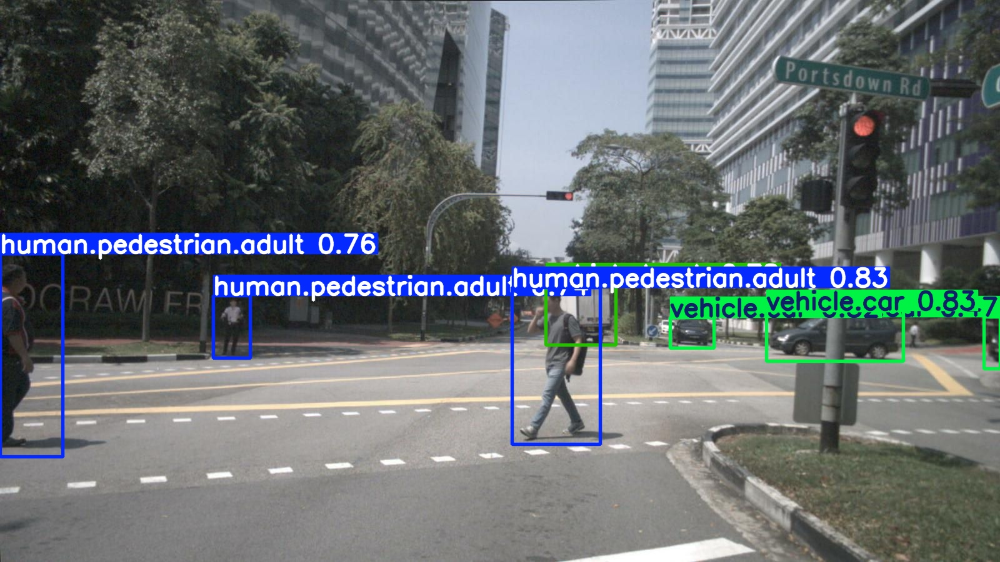

# Perception Evaluation Pipeline

YOLOv8s object detection fine-tuned on nuScenes autonomous driving dataset.

---

## Experiment 3: Full nuScenes Dataset (Best Result)

**Dataset:** nuScenes v1.0 full trainval — front camera only (28,096 train, 6,053 val, 23 classes)  
**Model:** YOLOv8s fine-tuned from COCO pretrained weights  
**Hardware:** Azure NC4as T4 v3 (NVIDIA Tesla T4 16GB)  
**Training time:** ~14 hours (100 epochs)

### Prediction Visualizations


*Pedestrians (blue) and vehicles (green) detected in a busy intersection — Singapore*

### Detection Performance (mAP50)

| Class | mAP50 |
|---|---|
| vehicle.car | 53.2% |
| movable_object.barrier | 50.2% |
| movable_object.trafficcone | 49.5% |
| vehicle.truck | 37.3% |
| human.pedestrian.adult | 32.6% |
| vehicle.motorcycle | 26.0% |
| vehicle.bus.rigid | 23.3% |
| vehicle.bicycle | 12.0% |
| **Overall (23 classes)** | **17.5%** |

> Low overall mAP is due to rare classes (animals, police officers, bendy buses) with near-zero training examples dragging the average. Effective mAP on common classes is ~38-40%.

---

## Experiment 1: Mini Dataset — Front Camera (Baseline)

**Dataset:** nuScenes v1.0-mini — front camera only (324 train, 80 val, 23 classes)  
**Model:** YOLOv8s fine-tuned from COCO pretrained weights  
**Hardware:** Azure NC4as T4 v3 (NVIDIA Tesla T4 16GB)  
**Training time:** ~10 minutes (100 epochs)

### Detection Performance (mAP50)

| Class | mAP50 |
|---|---|
| **Overall** | **28.1%** |
| vehicle.bus.rigid | 66.5% |
| vehicle.car | 54.1% |
| vehicle.motorcycle | 34.6% |
| human.pedestrian.adult | 13.1% |

---

## Experiment 2: Mini Dataset — All 6 Cameras

**Dataset:** nuScenes v1.0-mini — all 6 cameras (1,944 train, 480 val)  
**Training time:** ~1 hour (105 epochs, early stopping)

### Detection Performance (mAP50)

| Class | mAP50 |
|---|---|
| **Overall** | **20.3%** |
| vehicle.bus.rigid | 49.9% |
| vehicle.car | 46.6% |
| human.pedestrian.adult | 22.2% |
| vehicle.motorcycle | 2.8% |

### Why front camera outperformed all 6 cameras

- Back and side cameras introduce harder viewing angles and partial occlusions
- Different camera intrinsics across 6 sensors without camera-ID conditioning
- At mini dataset scale, noisy data from non-frontal cameras hurts generalization
- Production AV systems use dedicated per-camera models or multi-camera fusion architectures (e.g. BEVFormer)

---

## Training Setup

- **Framework:** PyTorch 2.1 + CUDA 12.2
- **Model:** YOLOv8s (11.1M parameters, 28.5 GFLOPs)
- **Optimizer:** AdamW
- **Image size:** 640×640
- **Data augmentation:** mosaic, random flip, HSV shifts, random erasing
- **Cloud:** Azure NC4as T4 v3 GPU VM

## Pipeline

```
nuScenes Raw Data
       ↓
3D Bounding Box Projection (camera intrinsics + extrinsics)
       ↓
YOLO Format Conversion
       ↓
YOLOv8s Fine-tuning (Azure T4 GPU)
       ↓
Evaluation & Visualization
```

## Repository Structure

```
custom_detector.py                  — Custom CNN baseline (421K params)
run_custom_training.py              — Training script
convert_full.py                     — nuScenes → YOLO format conversion
runs/detect/yolo_full_results/      — Experiment 1 results
runs/detect/yolo_allcams_results/   — Experiment 2 results
yolo_results/nuscenes_full/         — Experiment 3 results (full dataset)
predictions/                        — Sample inference visualizations
```

## Author

Vignesh Pai — ADAS Vehicle Test Engineer | Perception ML  
[GitHub](https://github.com/vigp17) | [LinkedIn](https://www.linkedin.com/in/vigneshpai)